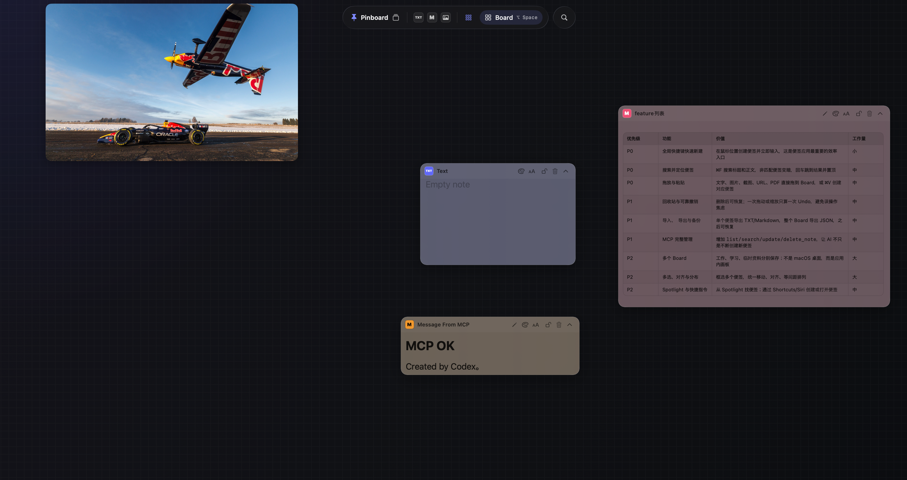

# Pinboard

[](https://github.com/Aethey/Pinboard/actions/workflows/build-macos.yml)

**English** · [简体中文](README.zh-CN.md) · [日本語](README.ja.md)

**A spatial note board for macOS.**



## Download

[**Download Pinboard 1.0 Beta 1 for macOS (.dmg)**](https://github.com/Aethey/Pinboard/releases/download/v1.0.0-beta.1/Pinboard-1.0.0-beta.1.dmg)

Open the DMG, then drag **Pinboard** into **Applications**. This preview build is intended for local testing and is not notarized yet. If macOS blocks the first launch, Control-click Pinboard in Applications, choose **Open**, then confirm **Open** once more.

Pinboard turns your screen into a flexible space for thoughts, references, and temporary information. Place notes wherever they make sense, keep related ideas together, and leave important content visible while you work.

There are no folders to organize before you begin. Open a board, put something down, and shape the space as your ideas develop.

## Highlights

- **Write anywhere:** double-click an empty point to create a note exactly where you need it. Pinboard automatically adjusts placement near window edges.
- **Infinite canvas:** pan freely and zoom from 25% to 250%. Use the 100% button in the top control bar or press `⌘0` to restore the natural scale without losing your current canvas center.
- **Notes, files, and links:** keep text, Markdown, images, PDFs, and web references together on one canvas.
- **Rich link previews:** paste or drop links from YouTube, TikTok, Bilibili, X, Vimeo, and most other public webpages to fetch their title, description, and preview image. When a site has no metadata, Pinboard keeps a clean link card with its address and added time.
- **External viewing:** double-click a PDF to open it in your default PDF app, or double-click a link to open it in your browser.
- **Multiple boards:** separate work, study, projects, and temporary material into independent spaces. Create or switch boards from the top control, and double-click a board name to rename it.
- **Fast search:** click Search or press `⌘F` to search the current board. Live suggestions appear as you type, unrelated cards fade into the background, and your 10 most recent searches remain close at hand.
- **Flexible cards:** move, resize, recolor, collapse, duplicate, lock, or delete a card. Clicking a card always brings it to the front.
- **Multi-selection:** press `⌘A` to select every card, or hold Command while dragging an empty area to draw a selection box. Selected cards keep a blue outline until you press `Esc` or click the canvas.
- **Batch text formatting:** use the selection toolbar to change the font size of selected text, Markdown, and Chat cards together. Images, PDFs, and links are skipped automatically.
- **Fit cards to their content:** resize selected text-based cards in one click so their full contents remain visible. Repeated fitting reuses measurements and avoids unnecessary saves.
- **Focused controls:** card actions stay compact and close to the content. Image controls appear only when you hover over that image.
- **Image OCR:** recognize text in a local image, then view the image and editable text side by side.
- **Readable Markdown:** switch between source and preview, with support for headings, lists, code, links, and scrollable tables.
- **Board and Desktop modes:** press `⌥ Space` to keep notes floating over the desktop without blocking the apps underneath.
- **Grid snapping:** use the grid when you want a tidy layout, or turn it off for free placement.
- **Automatic saving:** your boards, notes, and canvas view remain available the next time you open Pinboard.
- **No duplicate originals:** images and PDFs normally stay in their original Finder location. Pinboard remembers access and keeps only a lightweight preview; if macOS cannot preserve that access, Pinboard automatically keeps a private fallback copy. Large files never live inside the note database.
- **AI chat capture:** ask an MCP-compatible agent to save the current conversation. It generates a useful Markdown summary, identifies ChatGPT, Claude, Gemini, Cursor, or Codex, and keeps the original share link when one is available.
- **AI-generated boards:** describe one goal that needs several notes and let an MCP-compatible agent create the complete Board in one step. Pinboard arranges the cards into a readable grid and fits the initial zoom automatically.

## Quick guide

| Action | How |
| --- | --- |
| Create a text note | Double-click the board or use the Text button |
| Create a Markdown note | Use the Markdown button |
| Add an image | Use the Image button and choose an image |
| Add a PDF | Use the PDF button, or drag or paste a PDF onto the board |
| Add a webpage or video link | Click the Link button, or drag or paste its URL onto the board |
| Open a PDF or link | Double-click the card content, or use its Open button |
| Move around the canvas | Drag an empty area or scroll with a mouse or trackpad |
| Zoom the canvas | Pinch, use the bottom zoom controls, or click the top 100% button to reset |
| Move a note | Drag anywhere on its title bar |
| Move an image | Hover over it, then drag the top-left handle |
| Resize a card | Drag the handle at the bottom-right |
| Select multiple cards | Press `⌘A`, or hold Command and drag an empty area; press `Esc` to clear the selection |
| Change selected cards' font size | Select cards, then use Font size in the selection toolbar; unsupported card types are skipped |
| Fit selected cards to their text | Select cards, then click Fit content in the selection toolbar |
| Edit a title | Double-click the title text |
| Change color or font size | Use the palette or font-size button |
| Collapse or expand | Use the chevron button |
| Duplicate a card | Right-click the card |
| Lock or delete | Use the title-bar controls |
| Recognize text in an image | Hover over the image and use the OCR button |
| Create, switch, or rename a board | Use the board control; double-click its name to rename it |
| Search notes | Click Search or press `⌘F`; press Return to open the first result |
| Save the current AI conversation | Say “Save this chat to Pinboard” in a connected AI client |
| Create a complete Board with AI | Describe the goal and the separate notes you need; the agent creates and arranges them together |
| Switch Board/Desktop mode | Press `⌥ Space` |
| Maximize or restore the window | Double-click the top edge of the window |

## MCP integration

MCP lets an AI agent create notes and archive useful conversations in Pinboard. The Chat workflow is built into the MCP server instructions: the agent summarizes the conversation already in context, generates the title, identifies the provider, and creates the card without asking you to prepare the content manually.

### 1. Find the Pinboard MCP helper

When Pinboard is installed in Applications, the helper is located at:

```text
/Applications/Pinboard.app/Contents/MacOS/pinboard-mcp
```

If Pinboard is installed somewhere else, use the same path inside that `Pinboard.app`. Use the absolute path in your agent configuration.

### 2. Connect Codex

```bash
codex mcp add pinboard -- /Applications/Pinboard.app/Contents/MacOS/pinboard-mcp
codex mcp list
```

Restart Codex after adding the server. In the desktop app, you can also open **Settings → MCP servers**, add a **STDIO** server, and use the helper path as its command.

### 3. Connect Claude Code

```bash
claude mcp add --transport stdio pinboard -- /Applications/Pinboard.app/Contents/MacOS/pinboard-mcp
claude mcp list
```

You can also enter `/mcp` in Claude Code to check the connection.

### 4. Connect another MCP-compatible agent

Many local agents accept a configuration like this:

```json
{
  "mcpServers": {
    "pinboard": {
      "type": "stdio",
      "command": "/Applications/Pinboard.app/Contents/MacOS/pinboard-mcp",
      "args": []
    }
  }
}
```

The exact settings location depends on the agent.

### 5. Create a note with AI

Ask your agent something like:

```text
Use Pinboard to create a Markdown note titled "Today" with three tasks.
```

The MCP tool is named `create_note`.

| Parameter | Required | Meaning |
| --- | --- | --- |
| `content` | Yes | Note body, up to 20,000 characters |
| `title` | No | Note title, up to 200 characters |
| `kind` | No | `text` (default) or `markdown` |
| `x`, `y` | No | Card center position; provide both together |
| `theme` | No | `graphite`, `indigo`, `teal`, `amber`, or `rose` |

Images are currently added from inside Pinboard rather than through MCP.

### 6. Create a complete Board with AI

Describe the outcome instead of creating each note yourself:

```text
I have an interview tomorrow. Create a Pinboard Board with separate cheat sheets for my introduction, development skills, management skills, and questions to ask.
```

The agent calls `create_board` once, writes the content for every note, and sends the complete Board to Pinboard as one validated operation. Pinboard opens the new Board, arranges the notes in a grid, and chooses an initial zoom that keeps the set easy to scan.

| Parameter | Required | Meaning |
| --- | --- | --- |
| `name` | Yes | Board name, up to 80 characters |
| `notes` | Yes | Between 2 and 24 notes |
| `notes[].title` | Yes | A concise note title, up to 200 characters |
| `notes[].content` | Yes | Note body, up to 20,000 characters per note |
| `notes[].kind` | No | `markdown` (default) or `text` |
| `notes[].theme` | No | `graphite`, `indigo`, `teal`, `amber`, or `rose` |

### 7. Save the current chat

You only need to say:

```text
Save this chat to Pinboard.
```

The agent uses the `save_chat` tool and performs the organization itself. A Chat card renders the generated summary as Markdown and shows the provider's ChatGPT, Claude, Gemini, Cursor, or Codex icon.

| Parameter | Required | Meaning |
| --- | --- | --- |
| `title` | Yes | A concise title generated by the agent |
| `summary_markdown` | Yes | The organized conversation summary, up to 20,000 characters |
| `provider` | Yes | `chatgpt`, `claude`, `gemini`, `cursor`, `codex`, or `other`; inferred by the agent |
| `share_url` | No | A real HTTP(S) share link when it is already available |
| `x`, `y` | No | Card center position; provide both together |

The agent is instructed not to ask you for a manual summary or provider selection. It also must not invent a Share Link. If the AI client already exposes a real Share Link, Pinboard stores it behind the link button in the card title bar; otherwise the card is saved without that button.

### MCP troubleshooting

- If the agent cannot find `create_note`, `create_board`, or `save_chat`, confirm that `pinboard` appears in its MCP list, then restart the agent or begin a new task so it reloads the updated tool list.
- If Pinboard cannot be opened, confirm that the command points to the helper inside the installed `Pinboard.app`.
- If you keep more than one copy of Pinboard, point the command to the exact copy you want the agent to use.

## Quality and performance

Pinboard includes repeatable macOS UI performance tests, deterministic sample Boards, and dated benchmark records. See [Performance benchmarks](Benchmarks/README.md) for the tested interactions and results.

## Continuous integration

GitHub Actions builds a Release archive and packages it as a macOS DMG on pushes to `main`, version tags, pull requests, and manual runs. Download the DMG and its SHA-256 checksum from the workflow run's **Artifacts** section.

Pushing a `v*` tag whose commit belongs to `main` also creates or updates a GitHub Release and attaches both files. An annotated tag's message becomes the Release update notes; a lightweight tag produces an empty update description. Tags containing a hyphen, such as `v1.1.0-beta.1`, are published as prereleases.

```bash
git tag -a v1.1.0 -m "Describe the changes in this release"
git push origin main
git push origin v1.1.0
```

CI packages are ad-hoc signed for build verification, but they are not Developer ID signed or notarized. A public release still needs Apple signing credentials and notarization.
